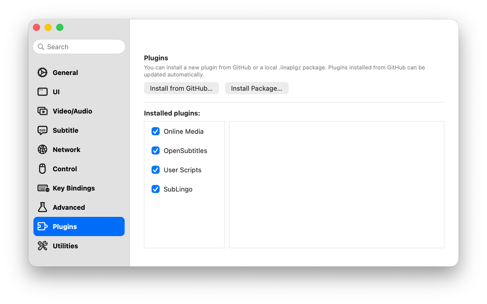

# SubLingo

**Traduction bilingue des sous-titres en temps réel pour IINA**

[English](../../README.md) · [简体中文](README.zh-CN.md) · [한국어](README.ko.md) · [日本語](README.ja.md) · [Русский](README.ru.md) · [العربية](README.ar.md) · **Français**

---

SubLingo traduit le sous-titre externe SRT ou ASS actuellement sélectionné dans [IINA](https://iina.io/) et affiche le résultat comme seconde piste de sous-titres. Il ne regarde qu'une courte distance devant la position de lecture et traduit par lots limités. Si une traduction prend du retard ou échoue, la vidéo et les sous-titres d'origine continuent d'être lus.

## ✨ Fonctionnalités

- **Sous-titres bilingues en temps réel :** le texte d'origine reste la piste principale et la traduction apparaît comme seconde piste IINA.
- **Prise en charge des SRT et ASS externes :** fonctionne avec les pistes texte SRT et ASS/SSA externes et lisibles sélectionnées dans IINA.
- **Service de traduction au choix :** utilisez un endpoint OpenAI-compatible Chat Completions ou un serveur Ollama local/distant.
- **Priorité à la lecture :** la traduction ne met jamais la vidéo en pause et ne masque pas les sous-titres d'origine.
- **Requêtes limitées :** SubLingo ne traduit que les cue proches, limite les tâches simultanées par fenêtre de lecture et ne met en cache les résultats réussis que pendant la session vidéo actuelle.
- **Plusieurs Profile :** enregistrez et testez des Profile de services, puis sélectionnez explicitement l'endpoint précis autorisé à recevoir le texte des sous-titres.
- **Contrôle du proxy :** utilisez les réglages proxy de macOS ou choisissez une connexion directe pour chaque Profile.

## ✅ Configuration requise

- macOS 12 ou version ultérieure
- IINA 1.4.0 ou version ultérieure
- Une piste texte externe SRT ou ASS/SSA lisible
- L'un des services de traduction suivants :
  - Un endpoint OpenAI-compatible, un Model ID et une API key si le service l'exige
  - Un serveur Ollama avec un modèle compatible déjà installé

SubLingo ne télécharge ni ne démarre les modèles de traduction.

## 🚀 Installation

Ouvrez IINA et accédez à **Préférences → Modules externes**. Le gestionnaire de modules permet les deux méthodes d'installation suivantes.

### Installer depuis GitHub (recommandé)

1. Cliquez sur **Installer depuis GitHub…**.
2. Saisissez `janwee-sha/SubLingo` dans le champ `user/repo`, puis confirmez l'installation.
3. Attendez que SubLingo apparaisse dans la liste des modules installés.

Les modules installés depuis GitHub peuvent être mis à jour automatiquement par IINA.

### Installer un paquet téléchargé

1. Ouvrez la page [Releases](https://github.com/janwee-sha/SubLingo/releases) et téléchargez le dernier paquet `SubLingo-X.Y.Z.iinaplgz`.
2. Revenez dans **Préférences → Modules externes** et cliquez sur **Installer le paquet…**.
3. Sélectionnez le fichier `.iinaplgz` téléchargé et confirmez l'installation.

Avec l'une ou l'autre méthode, approuvez les autorisations demandées si IINA les affiche, vérifiez que la case à côté de SubLingo est cochée, puis redémarrez IINA. Lancez ensuite une vidéo, ouvrez la barre latérale d'IINA et sélectionnez l'onglet **SubLingo**.

## 🌍 Démarrage rapide

1. Ouvrez une vidéo et sélectionnez un sous-titre externe SRT ou ASS comme sous-titre principal.
2. Dans **Languages**, sélectionnez votre langue maternelle. Si IINA ne peut pas identifier la langue du sous-titre, confirmez-la manuellement, puis enregistrez les réglages.
3. Dans **Translation service**, créez un Profile OpenAI-compatible ou Ollama et saisissez le Model ID exact.
4. Enregistrez et testez le Profile, puis cliquez sur **Select**. La sélection autorise explicitement SubLingo à envoyer le texte des sous-titres proches à l'endpoint affiché.
5. Activez **Translate**. Le sous-titre d'origine reste principal et les cue traduits apparaissent comme seconde piste.

Si l'endpoint, le modèle, l'API key ou la route réseau change, enregistrez le Profile modifié et sélectionnez-le à nouveau avant de traduire.

## ⚙️ Services de traduction

### OpenAI-compatible

- Saisissez l'API root, par exemple `https://example.com/v1`, et non une URL `/chat/completions` complète.
- SubLingo ajoute `/chat/completions` et affiche un aperçu de l'URL finale dans la barre latérale.
- Saisissez l'identifiant exact du modèle exposé par votre service.
- La Bearer API key n'est facultative que si l'endpoint accepte les requêtes sans authentification. Après l'enregistrement, le champ est en écriture seule et la valeur n'est plus affichée.
- Les endpoint distants doivent utiliser HTTPS.

### Ollama

- L'adresse par défaut du serveur est `http://127.0.0.1:11434`.
- Saisissez le tag exact du modèle installé, tel que `translategemma:12b` ou `qwen3:14b`.
- Les Profile Ollama n'enregistrent et n'utilisent aucun identifiant d'API.
- Le test de connexion vérifie le serveur, les tag installés et la prise en charge du structured-output chat.

Pour les deux services, commencez par **Use macOS proxy settings**. Ne choisissez **Connect directly** que si le proxy système configuré empêche l'accès au service.

## 🔒 Confidentialité, identifiants et coûts

- SubLingo envoie uniquement au Profile explicitement sélectionné le texte des cue proches, la direction des langues, des identifiants de cue opaques et un contexte voisin limité. Aucun contenu vidéo ou audio n'est envoyé.
- Les OpenAI-compatible API key sont stockées localement en clair dans le fichier privé `credentials.json` du plugin. Son répertoire utilise le mode `0700` et le fichier le mode `0600`. La key n'est inscrite ni dans les preferences IINA, ni dans les journaux, diagnostics, l'état de la Sidebar ou le paquet du plugin, et elle n'est plus affichée après l'enregistrement.
- Les autorisations du fichier protègent la key contre les autres comptes macOS et les accès accidentels ordinaires. Elles ne la protègent pas d'un processus déjà capable de lire les fichiers au nom de votre utilisateur macOS actuel.
- Le transport helper inclus n'écoute que sur un port temporaire `127.0.0.1` et n'envoie des requêtes distantes qu'à l'endpoint sélectionné. Les redirect inter-origines et les identifiants inclus dans les URL sont refusés.
- Les traductions ne sont mises en cache que pendant la session vidéo actuelle et sont effacées lors d'un changement de vidéo, à la fin de la lecture ou à la fermeture de la fenêtre.
- Votre Provider de traduction peut facturer les requêtes et appliquer ses propres politiques relatives aux données et au contenu. Le traitement par lots et le cache réduisent les appels, mais ne garantissent pas un coût maximal.

## 📌 Périmètre actuel

SubLingo n'effectue pas de transcription audio, d'OCR ou d'extraction des sous-titres graphiques/intégrés, de prétraduction de la vidéo entière, d'export des traductions, de synchronisation cloud ou de cache de traduction persistant.

## 🛠️ Dépannage

- **Select a readable external SRT or ASS subtitle :** sélectionnez un sous-titre texte externe comme piste principale dans IINA. Les pistes graphiques et intégrées ne sont pas prises en charge.
- **Confirm the subtitle language :** saisissez un tag de langue BCP 47, par exemple `en-US`, puis enregistrez les réglages.
- **Translation service unavailable :** testez le Profile et vérifiez son endpoint, son modèle, son API key, sa route réseau ou le processus Ollama. La vidéo et les sous-titres d'origine continuent normalement.
- **Credential could not be saved :** installez le paquet Release plutôt qu'une copie de développement incomplète, vérifiez que le répertoire de données du plugin est accessible en écriture, puis quittez complètement et relancez IINA.
- **Aucune seconde piste traduite :** vérifiez que le Profile est testé et sélectionné, que la langue source diffère de votre langue maternelle et que **Translate** est activé. Vérifiez aussi qu'IINA n'a pas changé manuellement la seconde piste après son chargement par SubLingo.
- **Le proxy bloque le service :** essayez d'abord la route proxy macOS par défaut. Si elle refuse le service, passez ce Profile à **Connect directly**, enregistrez-le, puis relancez Select/Test.

## 🧑‍💻 Développement

Les instructions de compilation, de vérification automatisée, de création du paquet et de validation dans IINA se trouvent dans le [guide de développement](../engineering/development.md).
