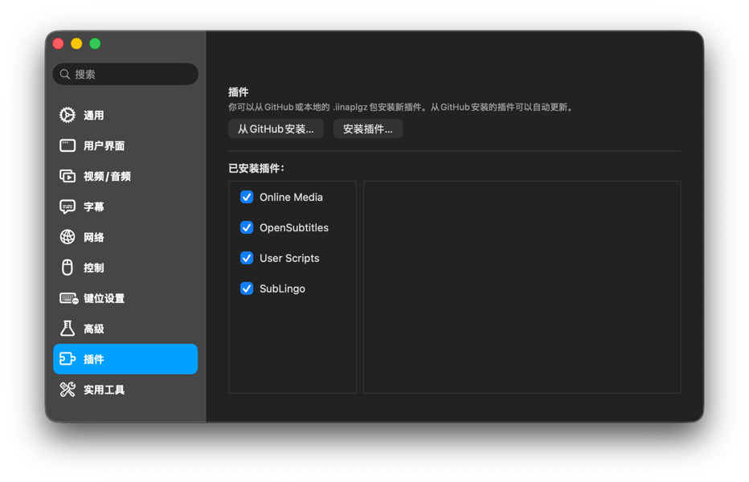

# SubLingo

**IINA向けリアルタイム二言語字幕翻訳**

[English](../../README.md) · [简体中文](README.zh-CN.md) · [한국어](README.ko.md) · **日本語** · [Русский](README.ru.md) · [العربية](README.ar.md) · [Français](README.fr.md)

---

SubLingoは、[IINA](https://iina.io/)で現在選択されている外部SRTまたはASS字幕を翻訳し、副字幕として表示します。再生位置の少し先だけを対象に、範囲を制限したバッチで翻訳します。翻訳が遅延または失敗しても、元の字幕と動画の再生は継続します。

## ✨ 機能

- **リアルタイム二言語字幕：** 元の字幕を主字幕のまま維持し、翻訳をIINAの副字幕として表示します。
- **外部SRT・ASS対応：** IINAで選択した、読み取り可能な外部SRTおよびASS/SSAテキスト字幕に対応します。
- **翻訳サービスを選択可能：** OpenAI-compatible Chat Completions endpoint、またはローカル/リモートのOllamaサーバーを利用できます。
- **再生を優先：** 翻訳処理によって動画が停止したり、元の字幕が非表示になったりすることはありません。
- **リクエスト範囲を制限：** 再生位置付近のcueだけを翻訳し、プレイヤーウインドウごとに同時処理を制限します。成功した翻訳は現在の動画セッション内でのみキャッシュします。
- **複数のProfile：** 翻訳サービスのProfileを保存・テストし、字幕テキストの送信先となる正確なendpointを明示的に選択できます。
- **プロキシ制御：** ProfileごとにmacOSのプロキシ設定または直接接続を選択できます。

## ✅ 動作要件

- macOS 12以降
- IINA 1.4.0以降
- 読み取り可能な外部SRTまたはASS/SSAテキスト字幕
- 次のいずれかの翻訳サービス：
  - OpenAI-compatible endpoint、Model ID、およびサービスが必要とする場合はAPI key
  - 対応モデルがインストール済みのOllamaサーバー

SubLingoは翻訳モデルをダウンロードしたり起動したりしません。

## 🚀 インストール

IINAを開き、**環境設定 → プラグイン**へ移動します。プラグイン管理画面では、次の2通りの方法でインストールできます。

### GitHubからインストール（推奨）

1. **GitHubからインストール…**をクリックします。
2. `user/repo`欄に`janwee-sha/SubLingo`と入力し、インストールを確定します。
3. インストール済みプラグインの一覧にSubLingoが表示されるまで待ちます。

GitHubからインストールしたプラグインは、IINAで自動的にアップデートできます。

### ダウンロードしたパッケージをインストール

1. [Releases](https://github.com/janwee-sha/SubLingo/releases)ページから最新の`SubLingo-X.Y.Z.iinaplgz`をダウンロードします。
2. **環境設定 → プラグイン**に戻り、**パッケージをインストール…**をクリックします。
3. ダウンロードした`.iinaplgz`ファイルを選択し、インストールを確定します。

どちらの方法でも、権限を求められた場合は承認し、SubLingoの横にあるチェックボックスが有効になっていることを確認してからIINAを再起動します。その後、動画を再生してIINAのサイドバーを開き、**SubLingo**タブを選択します。

## 🌍 クイックスタート

1. 動画を開き、外部SRTまたはASS字幕を主字幕として選択します。
2. **Languages**で母語を選択します。IINAが字幕言語を識別できない場合は手動で確認し、言語設定を保存します。
3. **Translation service**でOpenAI-compatibleまたはOllamaのProfileを作成し、正確なModel IDを入力します。
4. Profileを保存してテストし、**Select**をクリックします。Profileを選択すると、表示されたendpointへ再生位置付近の字幕テキストを送信することをSubLingoに明示的に許可します。
5. **Translate**をオンにします。元の字幕は主字幕のまま、翻訳されたcueが副字幕として表示されます。

Endpoint、モデル、API key、またはネットワーク経路を変更した場合は、更新したProfileを保存し、翻訳前に再選択してください。

## ⚙️ 翻訳サービス

### OpenAI-compatible

- 完全な`/chat/completions` URLではなく、`https://example.com/v1`のようなAPI rootを入力します。
- SubLingoが`/chat/completions`を追加し、最終的なリクエストURLをサイドバーに表示します。
- サービスが公開している正確なモデル識別子を入力します。
- Endpointが認証なしのリクエストを許可する場合に限り、Bearer API keyを省略できます。保存後、key入力欄は書き込み専用となり、再表示されません。
- リモートendpointはHTTPSを使用する必要があります。

### Ollama

- デフォルトのサーバーrootは`http://127.0.0.1:11434`です。
- `translategemma:12b`や`qwen3:14b`など、インストール済みモデルの正確なtagを入力します。
- OllamaのProfileはAPI認証情報を保存・使用しません。
- 接続テストでは、サーバー、インストール済みtag、structured-output chatの対応状況を確認します。

どちらのサービスでも、まず**Use macOS proxy settings**を使用してください。設定済みのシステムプロキシがサービスへのアクセスを妨げる場合のみ、**Connect directly**を選択します。

## 🔒 プライバシー、認証情報、料金

- SubLingoが明示的に選択したProfileへ送信するのは、再生位置付近の字幕テキスト、言語方向、不透明なcue ID、少量の隣接コンテキストだけです。動画や音声の内容は送信しません。
- OpenAI-compatible API keyは、プラグイン専用の`credentials.json`にローカル平文で保存されます。ディレクトリの権限は`0700`、ファイルの権限は`0600`です。KeyはIINA preferences、ログ、診断、Sidebar状態、プラグインパッケージには書き込まれず、保存後に再表示されません。
- ファイル権限は、ほかのmacOSアカウントや通常の偶発的アクセスからkeyを保護しますが、現在のmacOSユーザーとしてすでにファイルを読み取れるプロセスからは保護できません。
- 同梱のtransport helperは一時的な`127.0.0.1`ポートだけで待ち受け、選択したendpointにのみリモートリクエストを送信します。オリジンをまたぐredirectとURLに埋め込まれた認証情報は拒否されます。
- 翻訳は現在の動画セッション内でのみキャッシュされ、動画の変更、再生終了、ウインドウを閉じたときに消去されます。
- 翻訳Providerはリクエスト料金を請求し、独自のデータ・コンテンツポリシーを適用する場合があります。バッチ処理とキャッシュは呼び出し回数を減らしますが、料金の上限を保証するものではありません。

## 📌 現在の対象範囲

SubLingoは、音声文字起こし、画像ベースまたは埋め込み字幕のOCR/抽出、動画全体の事前翻訳、翻訳の書き出し、クラウド同期、永続的な翻訳キャッシュには対応していません。

## 🛠️ トラブルシューティング

- **Select a readable external SRT or ASS subtitle:** IINAで外部テキスト字幕を主字幕として選択してください。画像ベースおよび埋め込み字幕trackには対応していません。
- **Confirm the subtitle language:** `en-US`などのBCP 47言語tagを入力し、言語設定を保存してください。
- **Translation service unavailable:** Profileをテストし、endpoint、モデル、API key、ネットワーク経路、Ollamaプロセスを確認してください。動画と元の字幕は通常どおり再生を続けます。
- **Credential could not be saved:** 不完全な開発用コピーではなくReleaseパッケージをインストールし、プラグインデータディレクトリが書き込み可能であることを確認してから、IINAを完全に終了して再起動してください。
- **翻訳された副字幕が表示されない：** Profileがテスト済みで選択されていること、字幕言語と母語が異なること、**Translate**が有効であることを確認してください。また、SubLingoが読み込んだ後にIINAで副字幕を手動変更していないことも確認してください。
- **プロキシがサービスをブロックする：** まずデフォルトのmacOSプロキシ経路を試します。プロキシがサービスを拒否する場合、そのProfileを**Connect directly**に変更して保存し、再度Select/Testしてください。

## 🧑‍💻 開発

ビルド、自動チェック、パッケージング、IINAでの受け入れ手順については[開発ガイド](../engineering/development.md)を参照してください。
