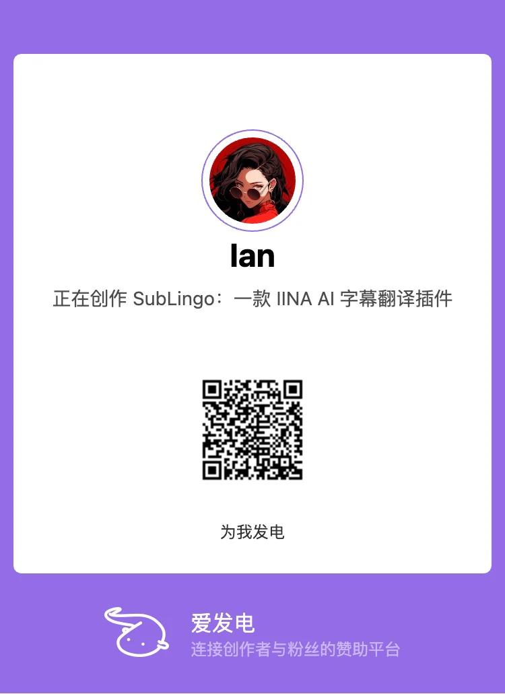

# SubLingo

**为 IINA 提供实时双语字幕翻译**

[English](../../README.md) · **简体中文** · [한국어](README.ko.md) · [日本語](README.ja.md) · [Русский](README.ru.md) · [العربية](README.ar.md) · [Français](README.fr.md)

---

SubLingo 翻译 [IINA](https://iina.io/) 当前选中的本地内嵌文本字幕或外部 SRT/ASS 字幕，并将译文显示为第二字幕。它只在播放位置附近有限前瞻、分批翻译；即使翻译延迟或失败，原字幕与视频也会继续播放。

## ✨ 功能

- **实时双语字幕：** 原字幕保持为主字幕，译文显示为 IINA 第二字幕。
- **支持内嵌与外部文本字幕：** 支持本地 Matroska SubRip/ASS/SSA、本地 MOV/MP4 `mov_text`，以及外部 SRT/ASS；正式包自带提取能力，无需安装 `ffmpeg` 或 `ffprobe`。
- **自选翻译服务：** 支持 OpenAI-compatible Chat Completions endpoint 和本地或远程 Ollama 服务。
- **播放优先：** 翻译工作不会暂停视频，也不会隐藏原字幕。
- **请求范围受限：** 只翻译播放位置附近的字幕；每个播放器窗口限制并发工作；成功译文只在当前视频会话内缓存。
- **多个 Profile：** 可保存并测试多个翻译服务 Profile，并明确选择允许接收字幕文字的确切 endpoint。
- **代理控制：** 每个 Profile 都可使用 macOS 系统代理或选择直连。

## ✅ 使用要求

- macOS 12 或更高版本
- IINA 1.4.0 或更高版本
- 受支持的本地内嵌文本字幕，或可读取的外部 SRT/ASS/SSA 字幕
- 以下任一翻译服务：
  - OpenAI-compatible endpoint、Model ID，以及服务要求时使用的 API key
  - 已安装兼容模型的 Ollama 服务

SubLingo 不会下载或启动翻译模型。

## 🚀 安装

打开 IINA，进入“**设置 → 插件**”。插件管理界面支持以下两种安装方式。

### 从 GitHub 安装（推荐）

1. 点击“**从 GitHub 安装…**”。
2. 在 `user/repo` 输入框中填写 `janwee-sha/SubLingo`，然后确认安装。
3. 等待 SubLingo 出现在“已安装插件”列表中。

通过 GitHub 安装的插件可由 IINA 自动更新。

### 安装下载的插件包

1. 打开 [Releases](https://github.com/janwee-sha/SubLingo/releases) 页面，下载最新的 `SubLingo-X.Y.Z.iinaplgz`。
2. 返回“**设置 → 插件**”，点击“**安装插件…**”。
3. 选择刚下载的 `.iinaplgz` 文件并确认安装。

无论使用哪种方式，如 IINA 提示授权，请批准所请求的插件权限；确认 SubLingo 左侧的复选框已勾选，然后重启 IINA。之后播放视频、打开 IINA 侧边栏并选择 **SubLingo** 标签页。

## 🌍 快速开始

1. 打开本地视频，并在 IINA 中选择受支持的内嵌文本字幕或外部 SRT/ASS 作为主字幕。
2. 在 **Languages** 中选择母语。如果 IINA 无法识别字幕语言，请手动确认，然后保存语言设置。
3. 在 **Translation service** 中创建 OpenAI-compatible 或 Ollama Profile，并填写准确的 Model ID。
4. 保存并测试 Profile，然后点击 **Select**。选择 Profile 即明确授权 SubLingo 向界面显示的 endpoint 发送播放位置附近的字幕文字。
5. 打开 **Translate**。原字幕仍为主字幕，译文会显示为第二字幕。

如果 endpoint、模型、API key 或网络路由发生变化，请保存更新后的 Profile，并在翻译前重新选择。

## ⚙️ 翻译服务

### OpenAI-compatible

- 填写 API root，例如 `https://example.com/v1`，不要填写完整的 `/chat/completions` URL。
- SubLingo 会追加 `/chat/completions`，并在侧边栏预览最终请求地址。
- 填写服务所提供的准确模型标识符。
- 只有 endpoint 允许匿名请求时才可省略 Bearer API key。保存后密钥输入框为只写状态，不会回显。
- 远程 endpoint 必须使用 HTTPS。

### Ollama

- 默认服务根地址为 `http://127.0.0.1:11434`。
- 填写准确的已安装模型标签，例如 `translategemma:12b` 或 `qwen3:14b`。
- Ollama Profile 不保存也不使用 API 凭据。
- 连接测试会检查服务器、已安装模型标签和 structured-output chat 支持。

无论使用哪种服务，都建议先选择 **Use macOS proxy settings**。只有系统代理导致服务无法访问时，才选择 **Connect directly**。

## 🔒 隐私、凭据与费用

- SubLingo 只向你明确选择的 Profile 发送播放位置附近的字幕文字、语言方向、不透明的字幕 ID 和少量相邻上下文，不会发送视频或音频内容。
- OpenAI-compatible API key 以本地明文保存在插件私有的 `credentials.json` 中。其目录权限为 `0700`，文件权限为 `0600`。密钥不会写入 IINA preferences、日志、诊断、Sidebar 状态或插件安装包，保存后也不会再次显示。
- 文件权限可以防止其他 macOS 账号和普通意外访问，但无法抵御已经能以当前 macOS 用户身份读取文件的进程。
- 随附的 transport helper 只监听临时的 `127.0.0.1` 端口，并且只向选定的 endpoint 发送远程请求。跨源重定向和 URL 中嵌入的凭据会被拒绝。
- 处理内嵌文本字幕时，随附的 extractor 只读取当前本地媒体中选中的轨道，并生成会话级临时 SRT；远程媒体和图形字幕不会被提取，解析、取消、超时或退出后会清理临时数据。
- 译文只在当前视频会话内缓存；换片、播放结束或关闭窗口时会被清除。
- 翻译服务可能收费，并适用其自身的数据与内容政策。批量处理和缓存可以减少调用次数，但不保证费用上限。

## 📌 当前范围

SubLingo 不提供音频转写、图形字幕 OCR/提取、远程媒体内嵌字幕提取、整片预翻译、译文导出、云同步或持久译文缓存。

## 🛠️ 故障排查

- **Select a supported text subtitle：** 在 IINA 中选择本地内嵌 SubRip/ASS/SSA/`mov_text` 或外部 SRT/ASS 作为主字幕。远程内嵌和图形字幕不受支持；可按状态提示重新选轨，或对失败的准备操作执行 Retry。
- **Confirm the subtitle language：** 输入 BCP 47 语言标签，例如 `en-US`，然后保存语言设置。
- **Translation service unavailable：** 测试 Profile，并检查 endpoint、模型、API key、网络路由或 Ollama 进程。视频和原字幕会继续正常播放。
- **Credential could not be saved：** 使用正式 Release 安装包，不要使用内容不完整的开发副本；确认插件数据目录可写，并完全退出后重启 IINA。
- **没有译文第二字幕：** 确认 Profile 已测试并选中、源语言与母语不同，并且已开启 **Translate**。还要确认 SubLingo 加载第二字幕后，IINA 没有被手动切换到其他第二字幕。
- **代理阻止服务连接：** 先尝试默认的 macOS 代理路由。如果代理拒绝该服务，将 Profile 改为 **Connect directly**，保存后重新 Select/Test。

## 🧑‍💻 开发

构建、自动化检查、打包和 IINA 验收说明见[开发指南](../engineering/development.md)。

## ☕ 支持 SubLingo

如果 SubLingo 对你有帮助，可以通过[爱发电](https://www.ifdian.net/item/ea1ff37a97ed11f19a9f52540025c377?utm_source=copylink&utm_medium=link)或 [Ko-fi](https://ko-fi.com/ianhsia) 自愿请创作者喝杯咖啡。

SubLingo 对所有人保持免费且功能完整。打赏不会解锁额外功能、优先翻译或专属版本，也不包含翻译服务 API 额度。你选择的 Provider 可能根据其条款与内容政策独立收费。
